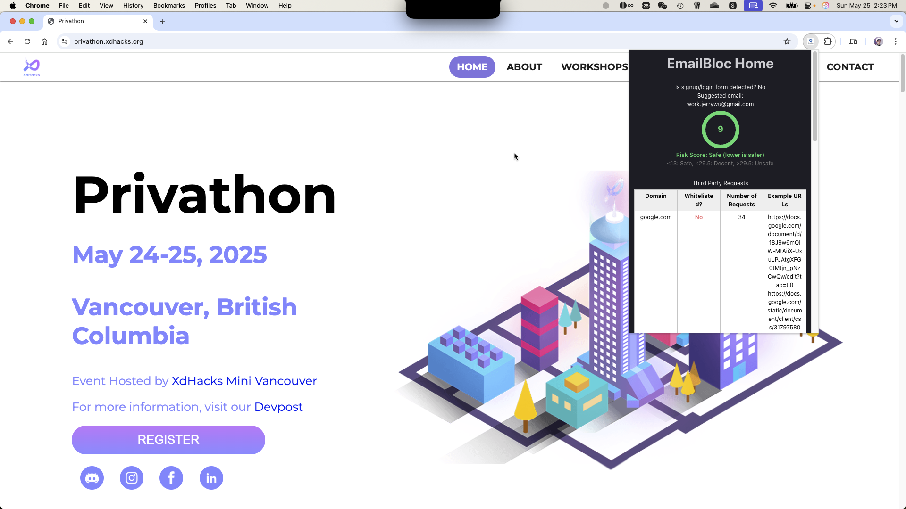

# EmailBloc (Privathon 2025)

## Inspiration 🧠

Too often, users reuse the same email address across websites with varying levels of trustworthiness. One data breach can compromise everything. We wanted to give users control by assigning importance-based emails and analyzing a site's behaviour before they even register.

## What it does ⚙️

EmailBloc is a Chrome extension that chooses the right email for every website signup based on the website's security and your intended usage. It automatically analyzes privacy risks—like third-party cookies and insecure connections, and selects one of your predefined emails (primary, secondary, backup, etc.) to sign up with. This keep your primary inbox safe and declutters spam from risky sites. It also provides a score for the website's security, and a list of privacy risks.

## How we built it 👷🔧

- JavaScript and Vite for the extension framework,
- Chrome Extension APIs (i.e. scripting, local storage, tabs, content scripts, puppeteer),
- Firebase Firestore (database for multi-device sync),
- Manual content script injector (using Chrome's scripting.exectuteScript to bypass CSP issues),
- Web privacy evaluation model modified from open source program Webbkoll
